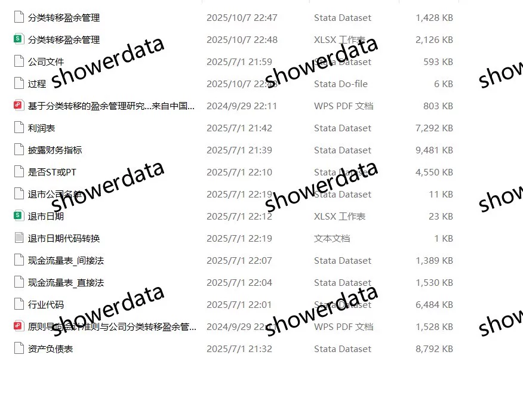
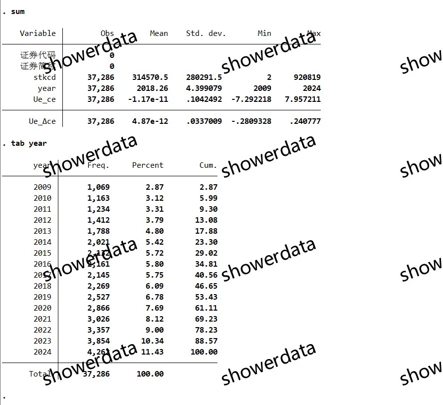
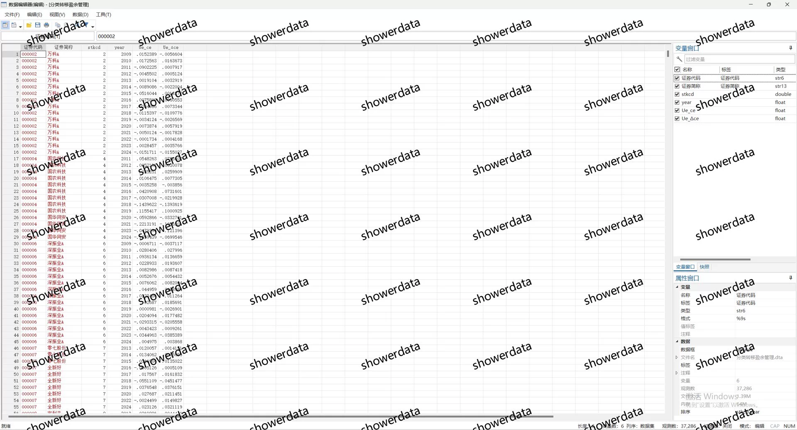

## Body

（2007-2024年）上市公司分类转移管理水平数据

一、数据介绍
数据名称：上市公司分类转移管理水平数据（包含未预期核心盈余和未预期核心盈余的变化数据）
样本范围：A鼓尚视公司,3.7w+观测值（已剔除，包含剔除代码，可以去除重新跑一遍获得未剔除数据）
时间范围：2007-2024年
数据格式：excel、dta
数据内容：结果数据、原始数据、do文件、参考文献

二、数据结果指标如图所示
Ue_ceit：未预期核心盈余
Ue_Δceit：未预期核心盈余的变化

三、计算方法如图所示

四、参考文献
[1]周嘉南.原则导向会计准则与公司分类转移盈余管理
[2]程富.基于分类转移的盈余管理研究——来自中国上市公司的经验证据

## Images

item_989055460907

Here is a pay link on Stripe ( https://buy.stripe.com/3cs8yP7sY87d0vu9AB ). Please contact me lonlonago@foxmail.com after funding $89, and I will send you a complete data files , thank you!

